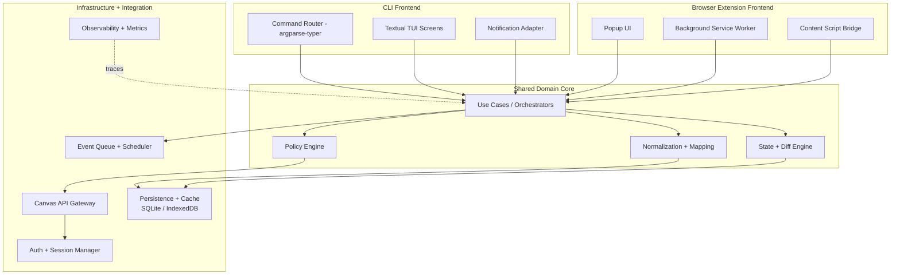

# CS3704 Canvas Project

A maintainable, team-ready **Canvas LMS productivity client** built around a Textual TUI today and a documented shared-core architecture for future browser-extension parity.

This repository is the cleaned-up **CS3704** project home for the team deliverables, source code, architecture artifacts, governance rules, and release automation.

[](https://github.com/kleinpanic/CS3704-Canvas-Project/actions/workflows/ci.yml)
[](https://github.com/kleinpanic/CS3704-Canvas-Project/actions/workflows/security.yml)
[](https://github.com/kleinpanic/CS3704-Canvas-Project/actions/workflows/pages.yml)
[](LICENSE)
[](https://www.python.org/)

## Why this repo exists

The project started from the earlier `CanvasTui-Proposal` work and was promoted into a course repo with:
- stronger project governance
- documentation and architecture assets for PM3+
- maintainable team workflows for a 4-person group
- CI/CD, security checks, and protected-branch discipline

## Core product direction

- **Current frontend:** Textual-based TUI for Canvas
- **Shared-core goal:** reusable orchestration, normalization, policy, and caching concepts
- **Future parity target:** browser extension can reuse the same domain logic and workflows conceptually

## Key features

- planner / assignment dashboard
- announcements and syllabus browsing
- grades overview and trend widgets
- file browsing + download workflows
- calendar / ICS export
- offline cache support
- pomodoro + notifications
- structured filtering and course views

## Repository layout

```text
.github/                  GitHub governance and workflow automation
src/canvas_tui/           application source
tests/                    automated tests
docs/architecture/        Mermaid + SVG architecture artifacts
docs/assets/architecture/ exported figures and captures
docs/project/             planning / migration / legacy project docs
docs-site/                GitHub Pages documentation source
```

## Architecture snapshot

### Static diagram


### Sync flow


### Mermaid overview


## Install

### pipx
```bash
pipx install .
```

### pip
```bash
pip install .
```

## Local development

```bash
python3 -m venv .venv
source .venv/bin/activate
pip install -e ".[dev]"
ruff check src tests
pytest -q
python -m build
```

## Configuration

Set a Canvas token and optional base URL:

```bash
export CANVAS_TOKEN="your_token_here"
export CANVAS_BASE_URL="https://canvas.vt.edu"
```

## Maintainer workflow

1. Open or pick an Issue
2. Branch from `main`
3. Open a PR
4. Pass CI/security checks
5. Get review
6. Merge through GitHub

See also:
- `CONTRIBUTING.md`
- `MAINTAINERS.md`
- `SECURITY.md`
- `docs-site/`

## Automation in this repo

- PR-only protected `main`
- required signed commits on protected branch
- CI: lint + tests + package build
- security: CodeQL + dependency review
- dependabot updates
- stale issue / PR handling
- PR auto-labeling by changed paths
- GitHub Pages docs portal
- automatic snapshot package release on clean `main` pushes

## Course context

This repo supports the **CS3704** project milestones. PM3 specifically emphasizes:
- high-level design
- low-level design + pattern reasoning
- design sketch / architecture visualization
- process evidence (Scrum review + planning)

## License

GPL-3.0-or-later. See `LICENSE`.
