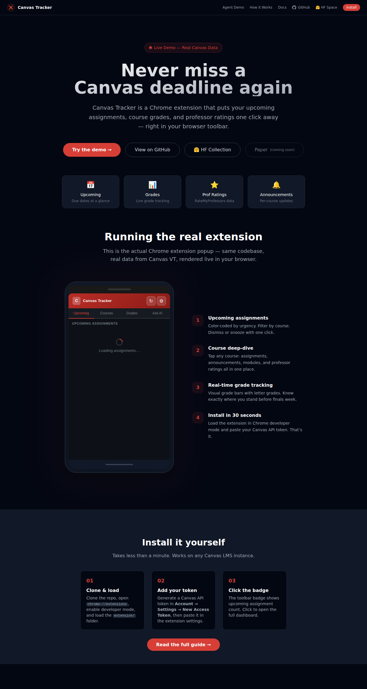

# CS3704 Canvas Project

A maintainable, team-ready **Canvas LMS productivity client** with a Textual TUI frontend, Chrome extension, Python SDK, and a fine-tuned calendar agent — with a documented shared-core architecture.

---

<!-- hero: Phase 10 -->
> **Canvas Tracker** — the fastest path from Canvas API token to a local calendar agent,
> polished TUI, and contribution-ready dataset pipeline.

<!-- asciinema cast: docs-site/casts/tui-demo.cast -->
<!-- TODO: record cast with `asciinema rec docs-site/casts/tui-demo.cast` + upload to asciinema.org -->
<!-- Static screenshot fallback: -->


| Deploy | Link |
|--------|------|
| PyPI (SDK) | [](https://pypi.org/project/canvas-sdk/) |
| Codespaces | [](https://codespaces.new/kleinpanic/CS3704-Canvas-Project) |
| HF Space | [](https://huggingface.co/spaces/kleinpanic93/canvas-calendar-agent-demo) |
| Docker | [](https://github.com/kleinpanic/CS3704-Canvas-Project/pkgs/container/canvas-tui) |

See [Quick Start](docs/QUICKSTART.md) · [Examples](examples/) · [Public Roadmap](ROADMAP.md)

---

<!-- badges: CI/CD | Distribution | Repo health | Tooling | HF/ML | Dev buttons (Phase 9) -->
[](https://github.com/kleinpanic/CS3704-Canvas-Project/actions/workflows/ci.yml)
[](https://github.com/kleinpanic/CS3704-Canvas-Project/actions/workflows/security.yml)
[](https://github.com/kleinpanic/CS3704-Canvas-Project/actions/workflows/pages.yml)
[](https://github.com/kleinpanic/CS3704-Canvas-Project/actions/workflows/release.yml)
<!-- codecov badge: removed pending codecov.io registration; see Phase 5/8 for restoration when CODECOV_TOKEN is wired -->
<br>
[](https://pypi.org/project/canvas-sdk/)
<!-- canvas-tui badge restored when #177 ships -->
[](https://pypi.org/project/canvas-sdk/)
[](https://github.com/kleinpanic/CS3704-Canvas-Project/pkgs/container/canvas-tui)
<br>
[](https://github.com/kleinpanic/CS3704-Canvas-Project/releases)
[](https://github.com/kleinpanic/CS3704-Canvas-Project/commits/main)
[](https://github.com/kleinpanic/CS3704-Canvas-Project/commits/main)
[](https://github.com/kleinpanic/CS3704-Canvas-Project/graphs/contributors)
<br>
[](LICENSE)
[](https://github.com/astral-sh/ruff)
[](https://github.com/kleinpanic/CS3704-Canvas-Project/actions/workflows/quick-checks.yml)
[](https://pre-commit.com/)
[](http://commitizen.github.io/cz-cli/)
[](https://securityscorecards.dev/viewer/?uri=github.com/kleinpanic/CS3704-Canvas-Project)
<br>
[](https://huggingface.co/spaces/kleinpanic93/canvas-calendar-agent-demo)
[](https://huggingface.co/spaces/kleinpanic93/canvas-pii-scrub)
[](https://huggingface.co/kleinpanic93/canvas-calendar-agent-v7-dpo)
[](https://huggingface.co/datasets/kleinpanic93/canvas-calendar-preferences-v7)
[](https://huggingface.co/collections/kleinpanic93/canvas-calendar-agent-v30-69fa6462f697e0342b21dfe0)
<br>
[](https://codespaces.new/kleinpanic/CS3704-Canvas-Project)
[](https://vscode.dev/redirect?url=vscode://ms-vscode-remote.remote-containers/cloneInVolume?url=https://github.com/kleinpanic/CS3704-Canvas-Project)

---

## Distribution

| Surface | Channel | Status |
|---------|---------|--------|
| **canvas-sdk** (Python) | [PyPI](https://pypi.org/project/canvas-sdk/) | live — v1.2.3 on PyPI |
| **canvas-tui** (Python) | [PyPI](https://pypi.org/project/canvas-tui/) | not yet published — pyproject.toml v2.0.0; tracked in [#177](https://github.com/kleinpanic/CS3704-Canvas-Project/issues/177) |
| **canvas-tui** (Docker) | `ghcr.io/kleinpanic/canvas-tui` | live — built nightly + on tag (#140) |
| **Chrome extension** | [Chrome Web Store](https://chromewebstore.google.com/) | listing in progress — install via `Load unpacked` for now |
| **HF Space demo** | [Live](https://huggingface.co/spaces/kleinpanic93/canvas-calendar-agent-demo) | live — auto-deploys on push to `main` |
| **HF Model** | [v7-DPO](https://huggingface.co/kleinpanic93/canvas-calendar-agent-v7-dpo) | live |

> **canvas-sdk v1.2.3 live on PyPI (API token).** OIDC trusted publisher not yet registered at pypi.org. Chrome Web Store listing in progress — install via `Load unpacked` for now.

---

## Quick Start

### Chrome Extension

1. Clone or download this repo.
2. In Chrome, open `chrome://extensions/` and enable **Developer mode**.
3. Click **Load unpacked** and select the `extension/` directory.
4. Pin the extension, open a Canvas page, and click the icon.

### Python SDK

```bash
pip install canvas-sdk[autodownload]    # fetches the v7-dpo Gemma4 model from HF on first run
pip install canvas-sdk[gemini]          # optional Gemini fallback
pip install canvas-sdk[all]             # both
```

> **Note:** PyPI publishes v1.2.3. The v2.0.0 local source (with the updated agent architecture)
> can be installed with `pip install -e src/sdk/`.

```python
import os
from canvas_sdk import CanvasAgent

os.environ["CANVAS_TOKEN"]    = "..."        # your Canvas API token
os.environ["CANVAS_BASE_URL"] = "https://canvas.vt.edu"

agent = CanvasAgent.auto()                   # auto-resolves: env -> local -> HF -> Gemini
print(agent.run("What is due this week?"))
```

`CanvasAgent.auto()` resolution order:
1. `CANVAS_LLM_ENDPOINT` env (skip auto-download, use your own server)
2. Local cache at `~/.cache/canvas-agent/v7-dpo/` (spawns vLLM on `:8765`)
3. Download `kleinpanic93/canvas-calendar-agent-v7-dpo` from HF, then (2)
4. Fall back to Gemini (`gemini-2.5-flash` by default)

### TUI (Terminal UI)

```bash
export CANVAS_TOKEN="your_canvas_token_here"
export CANVAS_BASE_URL="https://canvas.yourschool.edu"  # required — no default; tool exits with error if unset

pipx install .          # recommended
# or: pip install .

canvas-tui
```

---

## Live Demo

Try the fine-tuned Canvas Calendar Agent in your browser — no install required, no tokens needed:

- **Agent demo** (mock Canvas data, hosted DPO model): https://kleinpanic.github.io/CS3704-Canvas-Project/agent-demo/
- **HF Space** (full model, mock tools): https://huggingface.co/spaces/kleinpanic93/canvas-calendar-agent-demo
- **HF Collection** (v3.0 method matrix): https://huggingface.co/collections/kleinpanic93/canvas-calendar-agent-v30-69fa6462f697e0342b21dfe0

### Demo architecture (no tokens in client JS)

```
Browser  ->  Cloudflare Worker  ->  HF Space (ZeroGPU)
              ^                       ^
              |                       |
              | HF_TOKEN held as      | Gemma4 v7-dpo behind
              | Cloudflare secret     | gradio 5 ChatInterface +
              | (never reaches the    | 18 mock tool dispatchers
              | browser)              |
```

The HF token is stored as a Cloudflare Worker secret. Public clients only
see the proxy URL (`cs3704-demo-proxy.kleinpanic.workers.dev`); they never
receive any credential. See [`proxy/README.md`](proxy/README.md) for the
deploy procedure and [`proxy/iframe-fallback.html`](proxy/iframe-fallback.html)
for a zero-infra alternative that embeds the Space directly.

> **Token policy:** the SDK reads `CANVAS_TOKEN` and `GOOGLE_API_KEY` from
> your local environment. Tokens never enter the published browser demo,
> the GH Pages site, or any committed file. The Cloudflare Worker proxy is
> the only place an HF token is held, and it sits server-side as a Cloudflare
> secret. If you fork this project and host your own demo, follow the same
> pattern — see [`proxy/README.md`](proxy/README.md).

---

## Documentation

- **[Docs site](https://kleinpanic.github.io/CS3704-Canvas-Project/)** — live project docs
- **[Agent demo](https://kleinpanic.github.io/CS3704-Canvas-Project/agent-demo/)** — chat with the Canvas Calendar Agent in your browser
- **[Roadmap](https://kleinpanic.github.io/CS3704-Canvas-Project/roadmap.html)** — planned milestones and feature backlog
- **[HF Space](https://huggingface.co/spaces/kleinpanic93/canvas-calendar-agent-demo)** — full v7-dpo model behind a Gradio chat UI
- **[How it Works](https://kleinpanic.github.io/CS3704-Canvas-Project/agent-demo/method.html)** — DPO methodology, 9-method ablation matrix, G1–G13 guardrails, bench harness
- **[PyPI: canvas-sdk](https://pypi.org/project/canvas-sdk/)** — `pip install canvas-sdk`
- **[Architecture docs](https://kleinpanic.github.io/CS3704-Canvas-Project/docs/architecture/)** — system design decisions
- **[Browser extension docs](https://kleinpanic.github.io/CS3704-Canvas-Project/docs/extension/)** — shared client/runtime architecture
- **[Contributing](CONTRIBUTING.md)** — contribution guidelines and developer setup
- **[Maintainers](MAINTAINERS.md)** — maintainer responsibilities
- **[Security policy](SECURITY.md)** — security procedures

---

## Development

For team workflow, branch naming, repo structure, and dev setup, see [`CONTRIBUTING.md`](CONTRIBUTING.md).

---

## Contributors

[](https://github.com/kleinpanic/CS3704-Canvas-Project/graphs/contributors)

Made with [contrib.rocks](https://contrib.rocks).

---

## License

GPL-3.0-or-later. See [LICENSE](LICENSE).
