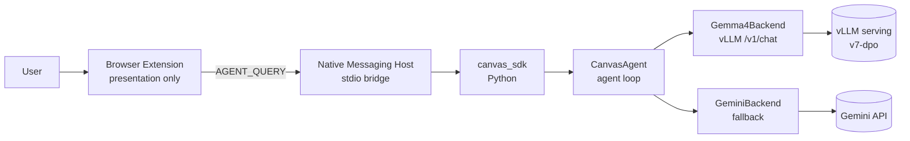
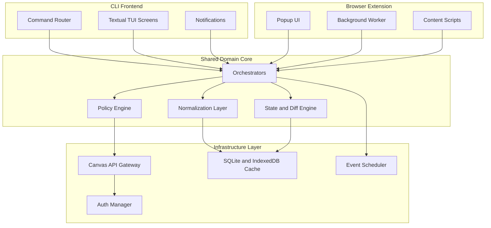

# CS3704 Canvas Project

A maintainable, team-ready **Canvas LMS productivity client** with a Textual TUI frontend and a documented shared-core architecture for future browser-extension parity.

[](https://github.com/kleinpanic/CS3704-Canvas-Project/actions/workflows/ci.yml)
[](https://github.com/kleinpanic/CS3704-Canvas-Project/actions/workflows/security.yml)
[](https://github.com/kleinpanic/CS3704-Canvas-Project/actions/workflows/pages.yml)
[](LICENSE)
[](https://www.python.org/)
[](https://huggingface.co/kleinpanic93/canvas-calendar-agent-v7-dpo)
[](https://huggingface.co/datasets/kleinpanic93/canvas-calendar-preferences-v7)
[](https://huggingface.co/spaces/kleinpanic93/canvas-calendar-agent-demo)

## Live demo

Try the fine-tuned Canvas Calendar Agent in your browser — no install required:

- **Browser chat UI** (mock Canvas data): https://kleinpanic.github.io/CS3704-Canvas-Project/demo/
- **HF Space (full model, mock tools)**: https://huggingface.co/spaces/kleinpanic93/canvas-calendar-agent-demo

## ML/AI components

The v2 milestone adds a **specialized calendar+study agent** that combines
Canvas API tool calls with neuroscience-grounded study planning heuristics
(spaced repetition, deep-work block sizing, exam bracketing).

The v7-DPO model is published on HuggingFace and the accompanying paper is
on Zenodo.

### Use the SDK in Python

```bash
pip install -e src/sdk
pip install canvas-sdk[autodownload]   # auto-pulls the v7-dpo model from HF on first use
python -m canvas_sdk.demo "What's due this week?"
```

```python
import os
from canvas_sdk import CanvasAgent

os.environ["CANVAS_TOKEN"] = "..."
os.environ["CANVAS_BASE_URL"] = "https://canvas.vt.edu"

agent = CanvasAgent.auto()             # auto-resolves: env -> local cache -> HF -> Gemini
print(agent.run("What's due this week?"))
```

`CanvasAgent.auto()` resolution order:
1. `CANVAS_LLM_ENDPOINT` env (skip auto-download, use your own server)
2. Local cache at `~/.cache/canvas-agent/v7-dpo/` (spawns vLLM on `:8765`)
3. Download `kleinpanic93/canvas-calendar-agent-v7-dpo` from HF, then (2)
4. Fall back to Gemini (`gemini-2.5-flash` by default)

### Try the fine-tuned model

- **Model card:** [huggingface.co/kleinpanic93/canvas-calendar-agent-v7-dpo](https://huggingface.co/kleinpanic93/canvas-calendar-agent-v7-dpo)
- **Preference dataset:** [huggingface.co/datasets/kleinpanic93/canvas-calendar-preferences-v7](https://huggingface.co/datasets/kleinpanic93/canvas-calendar-preferences-v7)
- **Training pipeline (paper + code):** [github.com/kleinpanic/CS3704-DPO-SSOT](https://github.com/kleinpanic/CS3704-DPO-SSOT)
- **Bench comparison (SFT vs DPO):** [docs/bench_v7_comparison.md](https://github.com/kleinpanic/CS3704-DPO-SSOT/blob/main/docs/bench_v7_comparison.md)

### Try the agent right now

The fine-tuned **v7-dpo Gemma4** weights are hosted as a live HuggingFace Space —
no API key required to try the demo, and the Python SDK auto-downloads the same
weights from HuggingFace Hub on first run.

- **Browser demo** (mock Canvas data, hosted DPO model): [kleinpanic.github.io/CS3704-Canvas-Project/agent-demo/](https://kleinpanic.github.io/CS3704-Canvas-Project/agent-demo/)
- **Python SDK** (real Canvas data via your token):

  ```bash
  pip install canvas-sdk[autodownload]    # fetches the v7-dpo Gemma4 model from HF on first run
  pip install canvas-sdk[gemini]          # optional last-resort Gemini fallback
  pip install canvas-sdk[all]             # both
  ```

  ```python
  import os
  from canvas_sdk import CanvasAgent

  os.environ["GOOGLE_API_KEY"]   = "..."        # for the Gemini fallback
  os.environ["CANVAS_TOKEN"]     = "..."        # your Canvas token
  os.environ["CANVAS_BASE_URL"]  = "https://canvas.vt.edu"

  agent = CanvasAgent.auto()                    # auto-resolves: env -> local -> HF -> Gemini
  print(agent.run("What is due this week?"))
  ```

  Resolution order for `CanvasAgent.auto()`:
  1. `CANVAS_LLM_ENDPOINT` env (skip auto-download, use your own server)
  2. Local cache at `~/.cache/canvas-agent/v7-dpo/` (spawns vLLM on :8765)
  3. Download `kleinpanic/canvas-calendar-agent-v7-dpo` from HF, then (2)
  4. Fall back to Gemini (`gemini-2.5-flash` by default)

---

## Overview

This is the **CS3704 team project repository** for a Canvas LMS productivity tool. It combines a working Textual TUI application with architecture documentation, team governance, and automated CI/CD.

### What this project does
- Centralized dashboard for Canvas assignments, announcements, and grades
- Offline-first caching for reliable access
- Calendar integration and ICS export
- Pomodoro timer and notification support
- Course filtering and quick navigation

### Architecture goals
- **Current**: Feature-complete TUI application
- **Current**: Browser extension with popup, background worker, IndexedDB cache, and shared JS client/runtime layer
- **Shared core direction**: Reusable domain logic and orchestration where practical across surfaces
- **Future**: Deeper parity between TUI and browser-facing features

---

## Architecture

### v2 ML stack — agent runtime



Contract: **the extension is GUI; the SDK is the only agent. Never duplicate tool parsing or
agent loops in the extension.** See [`REVIEW-extension-sdk.md`](REVIEW-extension-sdk.md).

### High-level system design



### Static diagrams
- **[Full Architecture](docs/architecture/complex-architecture.svg)** — component relationships
- **[Sync Flow](docs/architecture/sync-flow.svg)** — data refresh sequence

---

## Quick Start

### Installation

```bash
# Using pipx (recommended)
pipx install .

# Or using pip
pip install .
```

### Configuration

Set your Canvas API token:

```bash
export CANVAS_TOKEN="your_canvas_token_here"
export CANVAS_BASE_URL="https://canvas.vt.edu"  # optional, defaults to VT
```

### Run

```bash
canvas-tui
```

---

## Development

### Setup

```bash
python3 -m venv .venv
source .venv/bin/activate
pip install -e ".[dev]"
```

### Testing

```bash
ruff check src tests      # linting
pytest -q                  # run tests
python -m build           # build package
```

---

## Repository Structure

```
.github/                  CI/CD workflows and governance
src/canvas_tui/           Application source code
  agent/                  v2 CalendarAgent (tool calls + study planning)
src/sdk/canvas_sdk/       Python SDK — single source of agent logic
hf-space/                 HuggingFace Space (Gradio app loading v7-dpo)
tests/                    Test suite
scripts/                  Data contribution utilities (see scripts/README.md)
docs/                     Architecture and research docs
docs-site/                GitHub Pages documentation + browser demo
data/
  trajectories/           v2 SFT training data
    collab/               Teammate-contributed trajectory JSONL files
    seeds/                Canonical seed examples
  v1-reranker/            Legacy v1 preference pair data
extension/                Browser extension source (presentation only)
```

---

## Team Workflow

### For maintainers
1. Treat `main` as the only long-term branch
2. Use short-lived feature branches for scoped work when possible
3. Ensure CI passes before merging others' PRs
4. Prefer squash merges and let GitHub auto-delete merged branches

### For team members
1. **Never push directly to `main`**
2. Create a short-lived feature branch: `feature/your-feature-name`
3. Open a Pull Request into `main`
4. Wait for CI to pass and a maintainer to review
5. Merge with squash when approved

### Branch naming convention
- `feature/*` — new features
- `fix/*` — bug fixes
- `chore/*` — maintenance tasks
- `docs/*` — documentation updates

---

## Automation

This repository has extensive automation:

| Workflow | Purpose |
|----------|---------|
| **CI** | Ruff linting, pytest on Python 3.11/3.12/3.13, package build |
| **Security** | CodeQL analysis, dependency review |
| **Pages** | Auto-deploy documentation site |
| **Release** | Create snapshot release on main push |
| **Stale** | Close inactive issues/PRs after 30 days |
| **Labeler** | Auto-label PRs by changed files |

The repository is configured for squash-only merges into protected `main`, linear history, and branch auto-delete after merge.
All commits to protected branches must be **GPG signed**.

---

## Documentation

- **[Docs site](https://kleinpanic.github.io/CS3704-Canvas-Project/)** — live project docs
- **[Agent demo](https://kleinpanic.github.io/CS3704-Canvas-Project/agent-demo/)** — chat with the Canvas Calendar Agent in your browser (powered by our fine-tuned Gemma4 v7-dpo on HuggingFace Spaces)
- **[HF Space](https://huggingface.co/spaces/kleinpanic93/canvas-calendar-agent-demo)** — full v7-dpo model behind a Gradio chat UI
- **[Architecture docs](docs-site/architecture.md)** — system design decisions
- **[Browser extension docs](docs-site/extension.md)** — shared client/runtime architecture
- **[Workflow guide](docs-site/workflow.md)** — how the team works
- **[Contributing](CONTRIBUTING.md)** — contribution guidelines
- **[Maintainers](MAINTAINERS.md)** — maintainer responsibilities
- **[Security policy](SECURITY.md)** — security procedures

---

## Course Context

This repository supports **CS3704: Intermediate Software Design and Engineering** project milestones:

- **PM3**: Design documentation, architecture visualization, process evidence
- **PM4+**: Implementation, testing, and delivery

The architecture emphasizes maintainability for a mixed-skill team while protecting the codebase from accidental damage.

---

## License

GPL-3.0-or-later. See [LICENSE](LICENSE).
