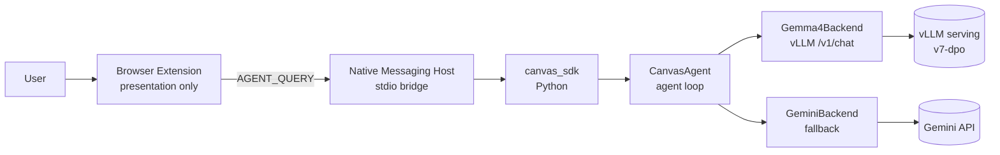
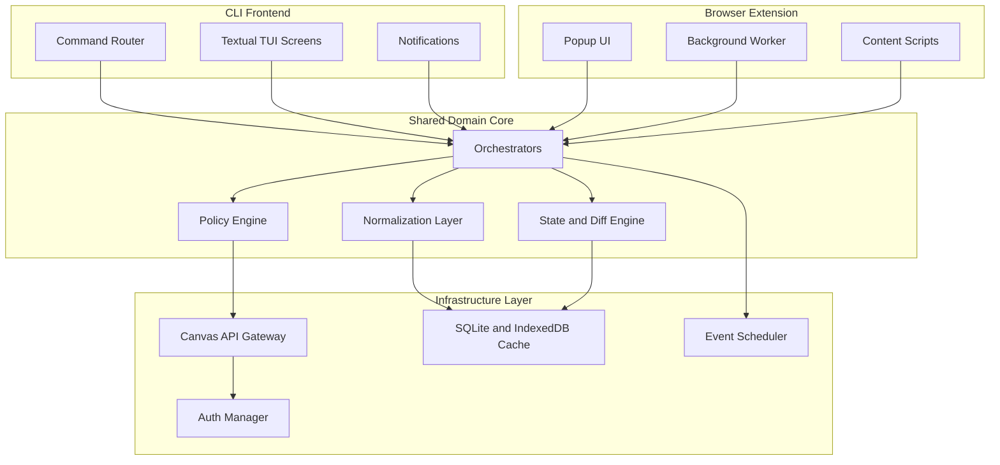

# CS3704 Canvas Project

A maintainable, team-ready **Canvas LMS productivity client** with a Textual TUI frontend, Chrome extension, Python SDK, and a fine-tuned calendar agent — with a documented shared-core architecture.

<!-- Build, repo, tooling, downstream — re-grouped 2026-05-06 -->
[](https://github.com/kleinpanic/CS3704-Canvas-Project/actions/workflows/ci.yml)
[](https://github.com/kleinpanic/CS3704-Canvas-Project/actions/workflows/security.yml)
[](https://github.com/kleinpanic/CS3704-Canvas-Project/actions/workflows/pages.yml)
[](https://github.com/kleinpanic/CS3704-Canvas-Project/actions/workflows/release.yml)
[](https://github.com/kleinpanic/CS3704-Canvas-Project/actions/workflows/coverage.yml)
<br>
[](https://github.com/kleinpanic/CS3704-Canvas-Project/releases)
[](https://github.com/kleinpanic/CS3704-Canvas-Project/commits/main)
[](https://github.com/kleinpanic/CS3704-Canvas-Project/commits/main)
[](https://github.com/kleinpanic/CS3704-Canvas-Project/graphs/contributors)
<br>
[](https://www.python.org/)
[](LICENSE)
[](https://github.com/astral-sh/ruff)
[](https://mypy-lang.org/)
[](https://pre-commit.com/)
<br>
[](https://huggingface.co/kleinpanic93/canvas-calendar-agent-v7-dpo)
[](https://huggingface.co/datasets/kleinpanic93/canvas-calendar-preferences-v7)
[](https://huggingface.co/collections/kleinpanic93/canvas-calendar-agent-v30-69fa6462f697e0342b21dfe0)
[](https://huggingface.co/spaces/kleinpanic93/canvas-calendar-agent-demo)
[](https://github.com/kleinpanic/CS3704-Canvas-Project/pkgs/container/canvas-tui)

---

## Distribution

| Surface | Channel | Status |
|---------|---------|--------|
| **canvas-sdk** (Python) | [PyPI](https://pypi.org/project/canvas-sdk/) | publish queued — see `release.yml` `publish-pypi` job |
| **canvas-tui** (Python) | [PyPI](https://pypi.org/project/canvas-tui/) | publish queued — `pyproject.toml` v1.1.1 |
| **canvas-tui** (Docker) | `ghcr.io/kleinpanic/canvas-tui` | live — built nightly + on tag (#140) |
| **Chrome extension** | [Chrome Web Store](https://chromewebstore.google.com/) | listing in progress — install via `Load unpacked` for now |
| **HF Space demo** | [Live](https://huggingface.co/spaces/kleinpanic93/canvas-calendar-agent-demo) | live — auto-deploys on push to `main` |
| **HF Model** | [v7-DPO](https://huggingface.co/kleinpanic93/canvas-calendar-agent-v7-dpo) | live |

> **PyPI publication queued — Chrome Web Store listing in progress.** Trusted publisher registration at pypi.org pending; first stable tag (`v1.0.0`+) will fire `publish-pypi`.

---

## Quick Start

### Chrome Extension

1. Clone or download this repo.
2. In Chrome, open `chrome://extensions/` and enable **Developer mode**.
3. Click **Load unpacked** and select the `extension/` directory.
4. Pin the extension, open a Canvas page, and click the icon.

### Python SDK

```bash
pip install canvas-sdk[autodownload]    # fetches the v7-dpo Gemma4 model from HF on first run
pip install canvas-sdk[gemini]          # optional Gemini fallback
pip install canvas-sdk[all]             # both
```

```python
import os
from canvas_sdk import CanvasAgent

os.environ["CANVAS_TOKEN"]    = "..."        # your Canvas API token
os.environ["CANVAS_BASE_URL"] = "https://canvas.vt.edu"

agent = CanvasAgent.auto()                   # auto-resolves: env -> local -> HF -> Gemini
print(agent.run("What is due this week?"))
```

`CanvasAgent.auto()` resolution order:
1. `CANVAS_LLM_ENDPOINT` env (skip auto-download, use your own server)
2. Local cache at `~/.cache/canvas-agent/v7-dpo/` (spawns vLLM on `:8765`)
3. Download `kleinpanic93/canvas-calendar-agent-v7-dpo` from HF, then (2)
4. Fall back to Gemini (`gemini-2.5-flash` by default)

### TUI (Terminal UI)

```bash
export CANVAS_TOKEN="your_canvas_token_here"
export CANVAS_BASE_URL="https://canvas.vt.edu"   # optional, defaults to VT

pipx install .          # recommended
# or: pip install .

canvas-tui
```

---

## Live Demo

Try the fine-tuned Canvas Calendar Agent in your browser — no install required, no tokens needed:

- **Agent demo** (mock Canvas data, hosted DPO model): https://kleinpanic.github.io/CS3704-Canvas-Project/agent-demo/
- **HF Space** (full model, mock tools): https://huggingface.co/spaces/kleinpanic93/canvas-calendar-agent-demo
- **HF Collection** (v3.0 method matrix): https://huggingface.co/collections/kleinpanic93/canvas-calendar-agent-v30-69fa6462f697e0342b21dfe0

### Demo architecture (no tokens in client JS)

```
Browser  ->  Cloudflare Worker  ->  HF Space (ZeroGPU)
              ^                       ^
              |                       |
              | HF_TOKEN held as      | Gemma4 v7-dpo behind
              | Cloudflare secret     | gradio 5 ChatInterface +
              | (never reaches the    | 18 mock tool dispatchers
              | browser)              |
```

The HF token is stored as a Cloudflare Worker secret. Public clients only
see the proxy URL (`cs3704-demo-proxy.kleinpanic.workers.dev`); they never
receive any credential. See [`proxy/README.md`](proxy/README.md) for the
deploy procedure and [`proxy/iframe-fallback.html`](proxy/iframe-fallback.html)
for a zero-infra alternative that embeds the Space directly.

> **Token policy:** the SDK reads `CANVAS_TOKEN` and `GOOGLE_API_KEY` from
> your local environment. Tokens never enter the published browser demo,
> the GH Pages site, or any committed file. The Cloudflare Worker proxy is
> the only place an HF token is held, and it sits server-side as a Cloudflare
> secret. If you fork this project and host your own demo, follow the same
> pattern — see [`proxy/README.md`](proxy/README.md).

---

## Overview

This is the **CS3704 team project repository** for a Canvas LMS productivity tool. It combines a working Textual TUI application with architecture documentation, team governance, and automated CI/CD.

### What this project does
- Centralized dashboard for Canvas assignments, announcements, and grades
- Offline-first caching for reliable access
- Calendar integration and ICS export
- Pomodoro timer and notification support
- Course filtering and quick navigation

### Architecture goals
- **Current**: Feature-complete TUI application
- **Current**: Browser extension with popup, background worker, IndexedDB cache, and shared JS client/runtime layer
- **Shared core direction**: Reusable domain logic and orchestration where practical across surfaces
- **Future**: Deeper parity between TUI and browser-facing features

---

## ML/AI Components

The v2 milestone adds a **specialized calendar+study agent** that combines
Canvas API tool calls with neuroscience-grounded study planning heuristics
(spaced repetition, deep-work block sizing, exam bracketing).

The v7-DPO model is published on HuggingFace and the accompanying paper is on Zenodo.

### Fine-tuned model resources

- **Model card:** [huggingface.co/kleinpanic93/canvas-calendar-agent-v7-dpo](https://huggingface.co/kleinpanic93/canvas-calendar-agent-v7-dpo)
- **Preference dataset:** [huggingface.co/datasets/kleinpanic93/canvas-calendar-preferences-v7](https://huggingface.co/datasets/kleinpanic93/canvas-calendar-preferences-v7)
- **Training pipeline (paper + code):** [github.com/kleinpanic/CS3704-DPO-SSOT](https://github.com/kleinpanic/CS3704-DPO-SSOT)
- **Bench comparison (SFT vs DPO):** [docs/bench_v7_comparison.md](https://github.com/kleinpanic/CS3704-DPO-SSOT/blob/main/docs/bench_v7_comparison.md)

### v3.0 fine-tuning matrix

The published **9-method matrix** (Gemma-4-E2B-IT trained on the same v7
dataset, varying only the loss/method) currently ships **DPO**. The remaining
**8 methods** (SFT, KTO, IPO, APO-Zero, SPPO, NCA, LoRA, QLoRA) plus the
12-quant GGUF expansion are queued — recipes and exact commands live in
[`MINIMAX-HANDOFF-v3.md`](https://github.com/kleinpanic/CS3704-DPO-SSOT/blob/main/.planning/MINIMAX-HANDOFF-v3.md)
in the SSOT repo.

### Run locally with Ollama

The fine-tuned agent is available as a GGUF for local inference via [Ollama](https://ollama.com):

```bash
ollama pull hf.co/kleinpanic93/canvas-calendar-agent-v7-dpo-gguf:Q4_K_M
ollama run hf.co/kleinpanic93/canvas-calendar-agent-v7-dpo-gguf:Q4_K_M "What assignments are due this week?"
```

| Tag | Size | Notes |
|-----|------|-------|
| `Q4_K_M` | ~3.2 GB | Recommended — fast + good quality |
| `Q8_0` | ~4.7 GB | Higher quality, larger memory |
| `f16` | ~8.7 GB | Reference / no quality loss |

Full GGUF repo: [kleinpanic93/canvas-calendar-agent-v7-dpo-gguf](https://huggingface.co/kleinpanic93/canvas-calendar-agent-v7-dpo-gguf)

---

## Architecture

### v2 ML stack — agent runtime



Contract: **the extension is GUI; the SDK is the only agent. Never duplicate tool parsing or
agent loops in the extension.**

### High-level system design



### Static diagrams
- **[Full Architecture](docs/architecture/complex-architecture.svg)** — component relationships
- **[Sync Flow](docs/architecture/sync-flow.svg)** — data refresh sequence

---

## Development

### Setup

```bash
python3 -m venv .venv
source .venv/bin/activate
pip install -e ".[dev]"
```

### Testing

```bash
ruff check src tests      # linting
pytest -q                 # run tests
python -m build           # build package
```

---

## Repository Structure

```
.github/                  CI/CD workflows and governance
extension/                Browser extension source (presentation only)
src/canvas_tui/           TUI application source code
  agent/                  v2 CalendarAgent (tool calls + study planning)
src/sdk/canvas_sdk/       Python SDK — single source of agent logic
hf-space/                 HuggingFace Space (Gradio app loading v7-dpo)
tests/                    Test suite
scripts/                  Data contribution utilities (see scripts/README.md)
docs/                     Architecture and research docs
docs-site/                GitHub Pages documentation + browser demo
data/
  trajectories/           v2 SFT training data
    collab/               Teammate-contributed trajectory JSONL files
    seeds/                Canonical seed examples
  v1-reranker/            Legacy v1 preference pair data
```

---

## Team Workflow

### For maintainers
1. Treat `main` as the only long-term branch
2. Use short-lived feature branches for scoped work when possible
3. Ensure CI passes before merging others' PRs
4. Prefer squash merges and let GitHub auto-delete merged branches

### For team members
1. **Never push directly to `main`**
2. Create a short-lived branch using one of the prefixes below
3. Open a Pull Request into `main`
4. Wait for CI to pass and a maintainer to review
5. Merge with squash when approved

### Branch naming convention

All branches must match `<prefix>/<slug>` where slug is lowercase letters, digits, dots, and hyphens.

| Prefix | Use for |
|--------|---------|
| `feature/*` | New features |
| `feat/*` | New features (short form) |
| `fix/*` | Bug fixes |
| `docs/*` | Documentation updates |
| `chore/*` | Maintenance and tooling |
| `refactor/*` | Code refactoring without behavior change |
| `test/*` | Test additions or fixes |
| `hotfix/*` | Urgent production fixes |
| `dependabot/*` | Automated dependency updates |

---

## Automation

| Workflow | Purpose |
|----------|---------|
| **CI** | Ruff linting, pytest on Python 3.11/3.12/3.13, package build |
| **Security** | CodeQL analysis, dependency review |
| **Pages** | Auto-deploy documentation site |
| **Release** | Create snapshot release on main push |
| **Stale** | Close inactive issues/PRs after 30 days |
| **Labeler** | Auto-label PRs by changed files |

The repository is configured for squash-only merges into protected `main`, linear history, and branch auto-delete after merge.
All commits to protected branches must be **GPG signed**.

---

## Documentation

- **[Docs site](https://kleinpanic.github.io/CS3704-Canvas-Project/)** — live project docs
- **[Agent demo](https://kleinpanic.github.io/CS3704-Canvas-Project/agent-demo/)** — chat with the Canvas Calendar Agent in your browser
- **[Roadmap](https://kleinpanic.github.io/CS3704-Canvas-Project/roadmap.html)** — planned milestones and feature backlog
- **[HF Space](https://huggingface.co/spaces/kleinpanic93/canvas-calendar-agent-demo)** — full v7-dpo model behind a Gradio chat UI
- **[How it Works](https://kleinpanic.github.io/CS3704-Canvas-Project/agent-demo/method.html)** — DPO methodology, 9-method ablation matrix, G1–G13 guardrails, bench harness
- **[PyPI: canvas-sdk](https://pypi.org/project/canvas-sdk/)** — `pip install canvas-sdk` (publishes on stable releases via OIDC trusted publishing)
- **[Architecture docs](https://kleinpanic.github.io/CS3704-Canvas-Project/docs/architecture/)** — system design decisions
- **[Browser extension docs](https://kleinpanic.github.io/CS3704-Canvas-Project/docs/extension/)** — shared client/runtime architecture
- **[Workflow guide](https://kleinpanic.github.io/CS3704-Canvas-Project/docs/workflow/)** — how the team works
- **[Contributing](CONTRIBUTING.md)** — contribution guidelines
- **[Maintainers](MAINTAINERS.md)** — maintainer responsibilities
- **[Security policy](SECURITY.md)** — security procedures

---

## Course Context

This repository supports **CS3704: Intermediate Software Design and Engineering** project milestones:

- **PM3**: Design documentation, architecture visualization, process evidence
- **PM4+**: Implementation, testing, and delivery

The architecture emphasizes maintainability for a mixed-skill team while protecting the codebase from accidental damage.

---

## License

GPL-3.0-or-later. See [LICENSE](LICENSE).
