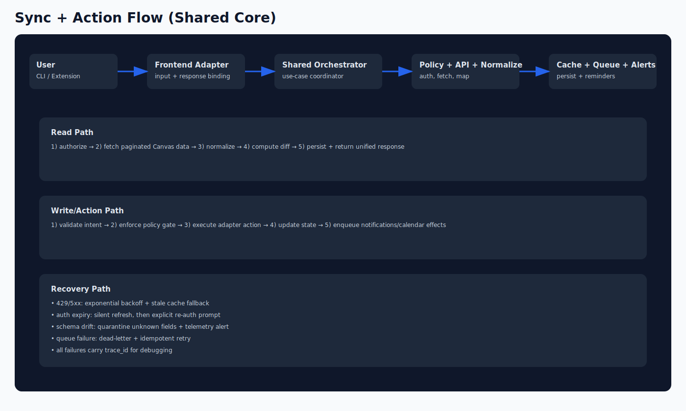
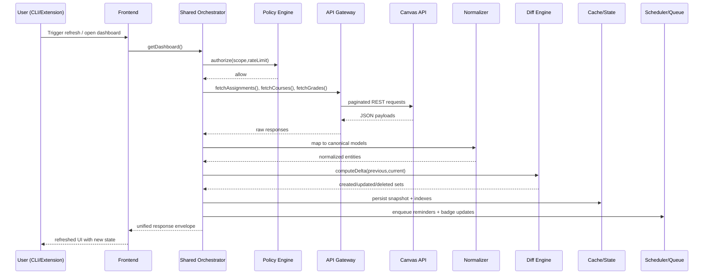

# CS7304 Canvas Project (Canvas TUI + Shared Core)

A full-featured terminal interface for [Canvas LMS](https://www.instructure.com/canvas), now packaged as a repo for the CS7304/CS3704 architecture and delivery workflow.

This repository includes:
- migrated source code from the prior CanvasTUI-Proposal workspace
- architecture captures from Figma
- Mermaid + SVG architecture diagrams
- PM3 review notes and a concrete remaining-work roadmap

[](https://github.com/kleinpanic/CS7304-Canvas-Project/actions/workflows/ci.yml)
[](LICENSE)
[](https://www.python.org/)
[](https://github.com/kleinpanic/CS7304-Canvas-Project)

## Architecture Visuals

### Inline SVG diagrams

#### Complex architecture (SVG)


#### Sync/action flow (SVG)


### Mermaid diagram (rendered by GitHub)

```mermaid
flowchart TB
  subgraph CLI[CLI Frontend]
    CLI_CMD[Command Router (argparse/typer)]
    CLI_TUI[Textual TUI Screens]
    CLI_NOTIF[Notification Adapter]
  end

  subgraph EXT[Browser Extension Frontend]
    EXT_POPUP[Popup UI]
    EXT_BG[Background Service Worker]
    EXT_CONTENT[Content Script Bridge]
  end

  subgraph CORE[Shared Domain Core]
    ORCH[Use Cases / Orchestrators]
    POLICY[Policy Engine]
    NORM[Normalization + Mapping]
    DIFF[State + Diff Engine]
  end

  subgraph INFRA[Infrastructure + Integration]
    API[Canvas API Gateway]
    AUTH[Auth + Session Manager]
    CACHE[Persistence + Cache<br/>SQLite / IndexedDB]
    QUEUE[Event Queue + Scheduler]
    OBS[Observability + Metrics]
  end

  CLI_CMD --> ORCH
  CLI_TUI --> ORCH
  CLI_NOTIF --> ORCH
  EXT_POPUP --> ORCH
  EXT_BG --> ORCH
  EXT_CONTENT --> ORCH

  ORCH --> POLICY --> API
  ORCH --> NORM --> CACHE
  ORCH --> DIFF --> CACHE
  ORCH --> QUEUE
  API --> AUTH
  OBS -. traces .-> ORCH
```

### Mermaid sequence view



### Figma captures
- `docs/assets/architecture/figma-architecture-full-canvas.png`
- `docs/assets/architecture/figma-architecture-detail-canvas.png`
- `docs/assets/architecture/figma-architecture-capture.pdf`

### Diagram source files
- `docs/architecture/complex-architecture.mmd`
- `docs/architecture/sync-sequence.mmd`

### Planning docs
- `docs/CS3704-PM3-REVIEW.md`
- `docs/NEXT-STEPS.md`

```
  ██████╗ █████╗ ███╗   ██╗██╗   ██╗ █████╗ ███████╗
 ██╔════╝██╔══██╗████╗  ██║██║   ██║██╔══██╗██╔════╝
 ██║     ███████║██╔██╗ ██║██║   ██║███████║███████╗
 ██║     ██╔══██║██║╚██╗██║╚██╗ ██╔╝██╔══██║╚════██║
 ╚██████╗██║  ██║██║ ╚████║ ╚████╔╝ ██║  ██║███████║
  ╚═════╝╚═╝  ╚═╝╚═╝  ╚═══╝  ╚═══╝  ╚═╝  ╚═╝╚══════╝
```

## Features

- **Planner View** — upcoming assignments, quizzes, discussions with color-coded urgency
- **Grades Overview** — per-course breakdown with weighted averages, sparkline trends
- **Announcements** — browse and read full announcement bodies with attachments
- **Syllabi Browser** — view HTML syllabi or preview PDF files inline
- **File Manager** — browse course files/folders, multi-select batch downloads
- **Calendar Week View** — 7-day grid with time-based item placement
- **Structured Filtering** — `course:CS3214 type:assignment status:graded` syntax with fuzzy search
- **Offline Mode** — disk-backed cache with stale-while-offline fallback
- **Pomodoro Timer** — configurable work timer with desktop notifications
- **Due Date Alerts** — background notifications at 60/30/15 minutes before deadlines
- **ICS Export** — export to `.ics` with optional calcurse import
- **Dark/Light Themes** — toggle with `T`
- **CLI Flags** — `--export-ics`, `--no-cache`, `--debug`, `--theme`, and more

## Requirements

- Python 3.11+ (for `tomllib`)
- Dependencies: `requests`, `textual`, `urllib3`
- Optional: `pdftotext` (for PDF syllabus preview), `keyring` (for secure token storage)

## Installation

### pipx (recommended)

```bash
pipx install .
```

### pip

```bash
pip install .
```

### Makefile

```bash
make install
# Installs to ~/.local/bin/canvas-tui with isolated venv
```

### Docker

```bash
docker build -t canvas-tui .
docker run -it -e CANVAS_TOKEN=your_token canvas-tui
```

## Configuration

### Token Setup

Create a Canvas access token in your Canvas profile settings → **Settings → New Access Token**.

**Option 1: Environment variable (simplest)**
```bash
export CANVAS_TOKEN="your_token_here"
export CANVAS_BASE_URL="https://canvas.yourschool.edu"  # default: https://canvas.vt.edu
```

**Option 2: Keyring (secure)**
```python
python3 -c "import keyring; keyring.set_password('canvas-tui', 'token', 'YOUR_TOKEN')"
```

### Config File

Optional TOML or JSON config at `~/.config/canvas-tui/config.toml`:

```toml
days_ahead = 14
past_hours = 48
auto_refresh_sec = 300
ann_future_days = 30
download_dir = "~/Downloads/Canvas"
```

### Environment Variables

| Variable | Default | Description |
|----------|---------|-------------|
| `CANVAS_TOKEN` | (required) | Canvas API access token |
| `CANVAS_BASE_URL` | `https://canvas.vt.edu` | Canvas instance URL |
| `TZ` | `America/New_York` | Timezone |
| `DAYS_AHEAD` | `7` | Days to look ahead |
| `PAST_HOURS` | `72` | Hours to show past items |
| `HTTP_TIMEOUT` | `20` | HTTP request timeout (seconds) |
| `AUTO_REFRESH_SEC` | `300` | Auto-refresh interval |
| `DOWNLOAD_DIR` | XDG default | Download directory override |

## CLI Usage

```
canvas-tui [OPTIONS]

Options:
  -V, --version              Show version
  -c, --config PATH          Config file path
  --no-cache                 Disable disk cache
  --debug                    Debug mode
  --export-ics               Export ICS and exit (no TUI)
  --prefetch                 Warm caches/state and exit (no TUI)
  --prefetch-daemon          Run continuous cache prefetch loop
  --prefetch-interval SEC    Prefetch loop interval (default: 300)
  --prefetch-no-grades       Skip grade endpoint warming
  --theme {dark,light}       Color theme
  --days-ahead N             Override DAYS_AHEAD
  --past-hours N             Override PAST_HOURS
```

## Faster Startup (Optional Prefetch Service)

If startup feels slow, warm cache in the background before launching TUI:

```bash
canvas-tui --prefetch
```

For continuous warm cache (great for login/boot-time service):

```bash
canvas-tui --prefetch-daemon --prefetch-interval 300
```

Example user-systemd unit:

```ini
# ~/.config/systemd/user/canvas-tui-prefetch.service
[Unit]
Description=Canvas TUI cache prefetch daemon
After=network-online.target
Wants=network-online.target

[Service]
ExecStart=%h/.local/bin/canvas-tui --prefetch-daemon --prefetch-interval 300
Restart=always
RestartSec=10

[Install]
WantedBy=default.target
```

Then enable:

```bash
systemctl --user daemon-reload
systemctl --user enable --now canvas-tui-prefetch.service
```

## Keyboard Shortcuts

### Navigation
| Key | Action |
|-----|--------|
| `↑`/`↓` | Move through items |
| `Enter` | Open full details |
| `d` | Quick preview |
| `Backspace`/`Esc` | Go back |

### Actions
| Key | Action |
|-----|--------|
| `o` | Open in browser |
| `g` | Open course page |
| `y` | Copy URL to clipboard |
| `w` | Download attachments |
| `c` | Export all to ICS |
| `C` | Export + import to calcurse |

### Filtering
| Key | Action |
|-----|--------|
| `/` | Toggle search filter |
| `x` | Cycle visibility (visible → dim → hidden) |
| `H` | Show/hide hidden items |

### Views
| Key | Action |
|-----|--------|
| `S` | Syllabi browser |
| `A` | Announcements |
| `G` | Grades overview |
| `F` | File manager |
| `W` | Calendar week view |
| `?` | Help screen |

### Pomodoro
| Key | Action |
|-----|--------|
| `1` | 30 min timer |
| `2` | 60 min timer |
| `3` | 120 min timer |
| `P` | Custom duration |
| `0` | Stop timer |

### General
| Key | Action |
|-----|--------|
| `r` | Refresh data |
| `T` | Toggle dark/light theme |
| `q` | Quit |

## Filter Syntax

The `/` key opens a structured filter prompt:

```
course:CS3214           Match course code or name
type:assignment         Match item type (assignment, quiz, discussion)
status:graded           Match status flags
has:points              Items with points > 0
has:due                 Items with a due date
"free text"             Fuzzy match across all fields
```

Combine filters: `course:CS3214 type:assignment homework`

Short prefixes: `c:CS3214 t:quiz s:graded`

## Data Storage

| Path | Contents |
|------|----------|
| `~/.local/share/canvas-tui/state.json` | Visibility, notes, pomodoro state |
| `~/.local/share/canvas-tui/cache/` | API response cache (auto-purged) |
| `~/.local/share/canvas-tui/canvas.ics` | Last ICS export |
| `~/.config/canvas-tui/config.toml` | User configuration |

## Architecture

```
src/canvas_tui/
├── __init__.py          # Version
├── app.py               # Main Textual App
├── api.py               # Canvas REST API client (retry, rate-limit, cache)
├── cache.py             # Disk-backed response cache with TTL
├── cli.py               # argparse CLI
├── config.py            # Config loading + validation
├── filtering.py         # Structured filtering + fuzzy search
├── models.py            # Typed dataclasses (CanvasItem, CourseInfo)
├── normalize.py         # API response → CanvasItem normalization
├── notifications.py     # Background due date alerts
├── state.py             # Thread-safe state manager
├── theme.py             # Dark/light theme system
├── utils.py             # HTML stripping, date parsing, helpers
├── screens/
│   ├── announcements.py # Announcements list + detail
│   ├── details.py       # Assignment detail view
│   ├── files.py         # File manager + batch downloads
│   ├── grades.py        # Grades overview with averages
│   ├── help.py          # Keybinding reference
│   ├── modals.py        # Input prompts, loading screen
│   ├── syllabi.py       # Syllabi browser + PDF preview
│   └── weekview.py      # 7-day calendar grid
└── widgets/
    └── pomodoro.py      # Pomodoro timer widget
```

## License

[GPL-3.0-or-later](LICENSE)
