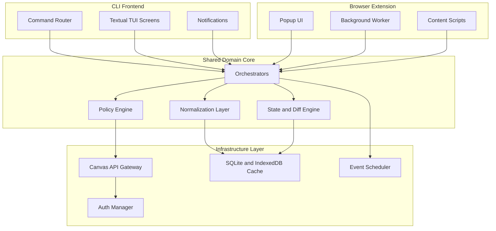

# CS3704 Canvas Project

A maintainable, team-ready **Canvas LMS productivity client** with a Textual TUI frontend and a documented shared-core architecture for future browser-extension parity.

[](https://github.com/kleinpanic/CS3704-Canvas-Project/actions/workflows/ci.yml)
[](https://github.com/kleinpanic/CS3704-Canvas-Project/actions/workflows/security.yml)
[](https://github.com/kleinpanic/CS3704-Canvas-Project/actions/workflows/pages.yml)
[](LICENSE)
[](https://www.python.org/)
[](https://huggingface.co/kleinpanic93/gemma4-canvas-reranker)
[](https://huggingface.co/datasets/kleinpanic93/canvas-preference-2k)
[](https://huggingface.co/collections/kleinpanic93/canvas-reranker-gemma-4-e2b-it-v10-69f5799662d65c8f39be0a94)
<!-- Zenodo DOI badge appears here once paper is deposited via source/deposit_zenodo.py -->

## ML/AI components

The reranker subsystem (`GemmaReranker/`) trains and evaluates 9 fine-tuning
methods (SFT, LoRA, QLoRA, DPO, IPO, APO-zero, SPPO, NCA, KTO) on a
Canvas preference dataset. v1 ships as a fast preference-hint model
([`kleinpanic93/gemma4-canvas-reranker`](https://huggingface.co/kleinpanic93/gemma4-canvas-reranker))
in 4 GGUF quants (Q4_K_M / Q5_K_M / Q8_0 / f16) plus the BF16 transformers
weights. v2 (in design) builds a **specialized calendar+study agent** that
uses the v1 model as one tool alongside Canvas API + calendar (Google Cal /
Outlook / calcurses) tool calls and neuroscience-grounded study planning
heuristics (spaced repetition, deep-work block sizing, exam bracketing). See
[GemmaReranker/README.md](GemmaReranker/README.md) for the full ML pipeline
and [`src/canvas_tui/agent/`](src/canvas_tui/agent/) for the consumer-side
agent code.

---

## Overview

This is the **CS3704 team project repository** for a Canvas LMS productivity tool. It combines a working Textual TUI application with architecture documentation, team governance, and automated CI/CD.

### What this project does
- Centralized dashboard for Canvas assignments, announcements, and grades
- Offline-first caching for reliable access
- Calendar integration and ICS export
- Pomodoro timer and notification support
- Course filtering and quick navigation

### Architecture goals
- **Current**: Feature-complete TUI application
- **Current**: Browser extension with popup, background worker, IndexedDB cache, and shared JS client/runtime layer
- **Shared core direction**: Reusable domain logic and orchestration where practical across surfaces
- **Future**: Deeper parity between TUI and browser-facing features

---

## Architecture

### High-level system design



### Static diagrams
- **[Full Architecture](docs/architecture/complex-architecture.svg)** — component relationships
- **[Sync Flow](docs/architecture/sync-flow.svg)** — data refresh sequence

---

## Quick Start

### Installation

```bash
# Using pipx (recommended)
pipx install .

# Or using pip
pip install .
```

### Configuration

Set your Canvas API token:

```bash
export CANVAS_TOKEN="your_canvas_token_here"
export CANVAS_BASE_URL="https://canvas.vt.edu"  # optional, defaults to VT
```

### Run

```bash
canvas-tui
```

---

## Development

### Setup

```bash
python3 -m venv .venv
source .venv/bin/activate
pip install -e ".[dev]"
```

### Testing

```bash
ruff check src tests      # linting
pytest -q                  # run tests
python -m build           # build package
```

---

## Repository Structure

```
.github/                  CI/CD workflows and governance
src/canvas_tui/           Application source code
tests/                    Test suite
docs/architecture/        Mermaid diagrams and SVG exports
docs/assets/              Static images and captures
docs/project/             Planning artifacts and legacy docs
docs-site/                GitHub Pages documentation
extension/                Browser extension source
sdk/                      Python SDK experiments and support code
```

---

## Team Workflow

### For maintainers
1. Treat `main` as the only long-term branch
2. Use short-lived feature branches for scoped work when possible
3. Ensure CI passes before merging others' PRs
4. Prefer squash merges and let GitHub auto-delete merged branches

### For team members
1. **Never push directly to `main`**
2. Create a short-lived feature branch: `feature/your-feature-name`
3. Open a Pull Request into `main`
4. Wait for CI to pass and a maintainer to review
5. Merge with squash when approved

### Branch naming convention
- `feature/*` — new features
- `fix/*` — bug fixes
- `chore/*` — maintenance tasks
- `docs/*` — documentation updates

---

## Automation

This repository has extensive automation:

| Workflow | Purpose |
|----------|---------|
| **CI** | Ruff linting, pytest on Python 3.11/3.12/3.13, package build |
| **Security** | CodeQL analysis, dependency review |
| **Pages** | Auto-deploy documentation site |
| **Release** | Create snapshot release on main push |
| **Stale** | Close inactive issues/PRs after 30 days |
| **Labeler** | Auto-label PRs by changed files |

The repository is configured for squash-only merges into protected `main`, linear history, and branch auto-delete after merge.
All commits to protected branches must be **GPG signed**.

---

## Documentation

- **[Docs site](https://kleinpanic.github.io/CS3704-Canvas-Project/)** — live project docs
- **[Architecture docs](docs-site/architecture.md)** — system design decisions
- **[Browser extension docs](docs-site/extension.md)** — shared client/runtime architecture
- **[Workflow guide](docs-site/workflow.md)** — how the team works
- **[Contributing](CONTRIBUTING.md)** — contribution guidelines
- **[Maintainers](MAINTAINERS.md)** — maintainer responsibilities
- **[Security policy](SECURITY.md)** — security procedures

---

## Course Context

This repository supports **CS3704: Intermediate Software Design and Engineering** project milestones:

- **PM3**: Design documentation, architecture visualization, process evidence
- **PM4+**: Implementation, testing, and delivery

The architecture emphasizes maintainability for a mixed-skill team while protecting the codebase from accidental damage.

---

## License

GPL-3.0-or-later. See [LICENSE](LICENSE).
