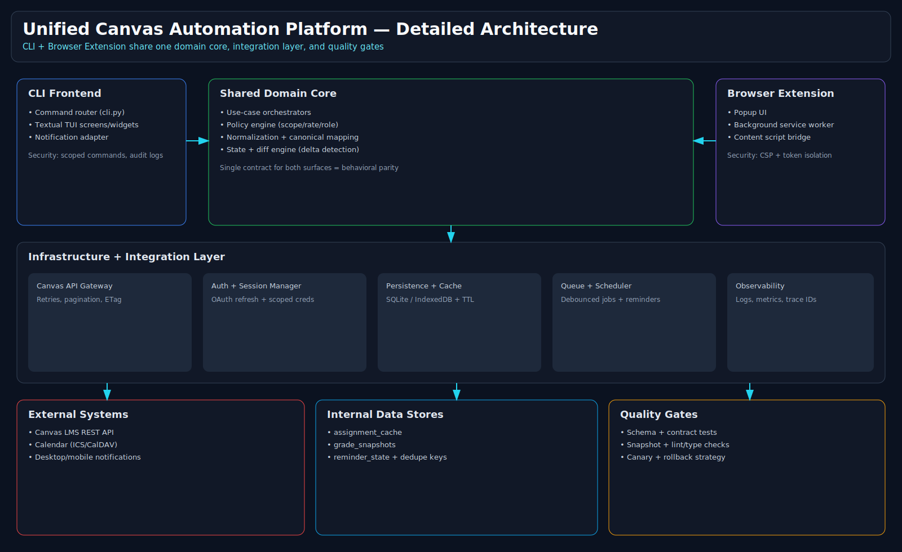

# Architecture

The project uses a **shared-core** architecture: the Textual TUI and a future browser extension both depend on the same orchestration, normalization, policy, and caching concepts.

## Static architecture board

## Sync flow

## Source files
- `docs/architecture/complex-architecture.mmd`
- `docs/architecture/sync-sequence.mmd`
- `docs/assets/architecture/*`
